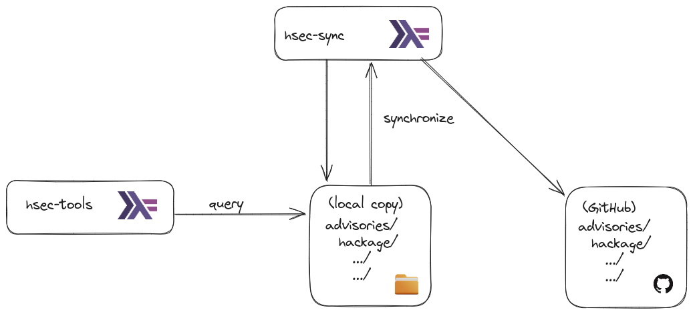
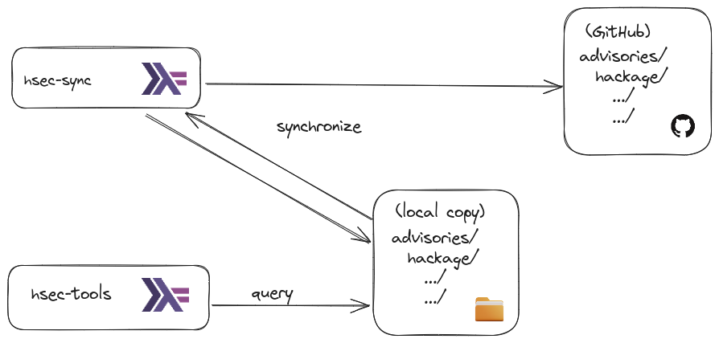

# hsec-sync

Synchronize with the [Haskell advisories database](https://github.com/haskell/security-advisories).

## Building

We aim to support both regular cabal-based and nix-based builds.

## Design

[hsec-tools](../hsec-tools/) is the main entry point for dealing with [security advisories](https://github.com/haskell/security-advisories).

Libraries implementors and services providers will mainly be interested by
`Security.Advisories.Queries` and `hsec-tools query` which allows querying
against a directory containing the advisories.

There are two ways for maintaining this local directory up-to-date:

* Manually (based on `git` of fetching archive from GitHub)
* Relying on `hsec-sync` (either via `Security.Advisories.Sync.sync` or `hsec-sync sync`)

The recommended workflow is:

1. Use `hsec-sync` to ensure having an up-to-date advisories directory (created or updated)
2. Use `hsec-tools` to perform queries against it

